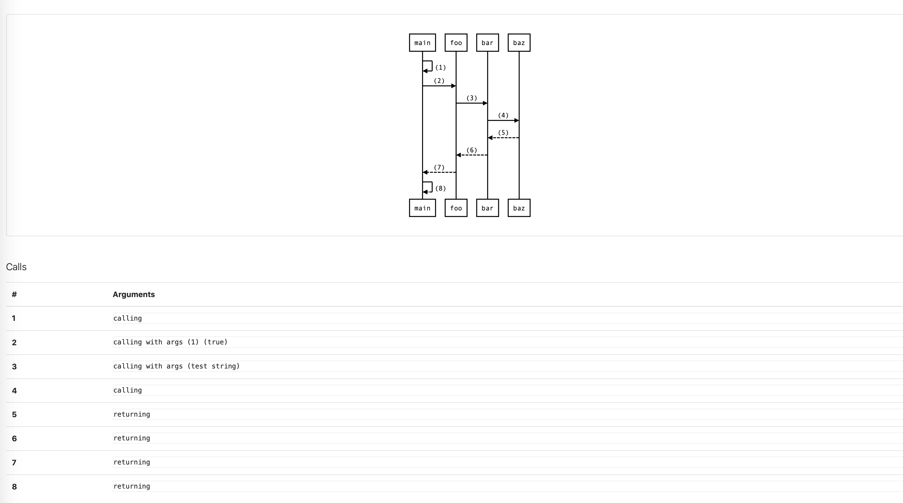
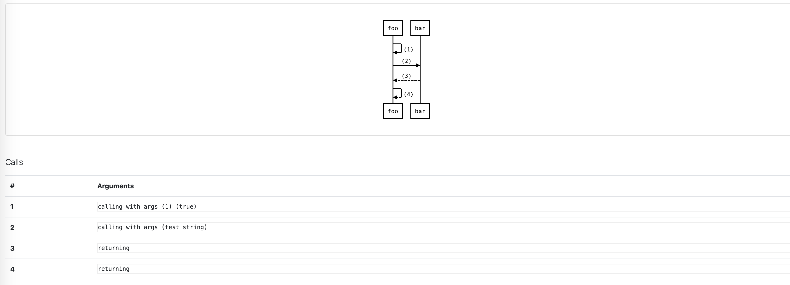

# prinTracer
[](https://travis-ci.org/DimitarPetrov/printracer)
[](https://coveralls.io/github/DimitarPetrov/printracer?branch=master)
[](https://goreportcard.com/report/github.com/DimitarPetrov/printracer)

## Overview

`printracer` is a simple command line tool that instruments all **go** code in the current working directory to print every
 function execution along with its arguments.
 
## Installation

#### Installing from Source
```
go get -u github.com/DimitarPetrov/printracer
```

## Demonstration

### Code Instrumentation

Let's say you have a simple `main.go` file in the current working directory with the following contents:
```go
package main

func test(i int, b bool) int {
	if b {
		return i
	}
	return 0
}

func main() {
	_ = test(2, false)
}
```

After executing:
```
printracer apply
```

The file will be modified like the following:
```go
package main

import (
	"crypto/rand"
	"fmt"
	rt "runtime"
)

func test(i int, b bool) int {

	/* prinTracer */
	funcName := "test"
	caller := "unknown"
	if funcPC, _, _, ok := rt.Caller(0); ok {
		funcName = rt.FuncForPC(funcPC).Name()
	}
	if callerPC, _, _, ok := rt.Caller(1); ok {
		caller = rt.FuncForPC(callerPC).Name()
	}
	idBytes := make([]byte, 16)
	_, _ = rand.Read(idBytes)
	callID := fmt.Sprintf("%x-%x-%x-%x-%x", idBytes[0:4], idBytes[4:6], idBytes[6:8], idBytes[8:10], idBytes[10:])
	fmt.Printf("Function %s called by %s with args (%v) (%v); callID=%s\n", funcName, caller, i, b, callID)
	defer fmt.Printf("Exiting function %s called by %s; callID=%s\n", funcName, caller, callID) /* prinTracer */

	if b {
		return i
	}
	return 0
}

func main() {

	/* prinTracer */
	funcName := "main"
	caller := "unknown"
	if funcPC, _, _, ok := rt.Caller(0); ok {
		funcName = rt.FuncForPC(funcPC).Name()
	}
	if callerPC, _, _, ok := rt.Caller(1); ok {
		caller = rt.FuncForPC(callerPC).Name()
	}
	idBytes := make([]byte, 16)
	_, _ = rand.Read(idBytes)
	callID := fmt.Sprintf("%x-%x-%x-%x-%x", idBytes[0:4], idBytes[4:6], idBytes[6:8], idBytes[8:10], idBytes[10:])
	fmt.Printf("Function %s called by %s; callID=%s\n", funcName, caller, callID)
	defer fmt.Printf("Exiting function %s called by %s; callID=%s\n", funcName, caller, callID) /* prinTracer */

	_ = test(2, false)
}
```
When running the instrumented file above the output (so called trace) will be as follows:
```
Function main.main called by runtime.main; callID=0308fc13-5b30-5871-9101-b84e055a9565
Function main.test called by main.main with args (2) (false); callID=1a3feff5-844b-039c-6d20-307d52002ce8
Exiting function main.test called by main.main; callID=1a3feff5-844b-039c-6d20-307d52002ce8
Exiting function main.main called by runtime.main; callID=0308fc13-5b30-5871-9101-b84e055a9565
```

You can also easily revert all the changes done by `printracer` by just executing:
```
printracer revert
```

> NOTE: `printracer revert` reverts changes only if code block enclosed by /* prinTracer */ comment is not modified by hand. If you modify the instrumentation block then it should be manually reverted afterwards. 

> NOTE: `printracer apply` will not apply any changes if find /* prinTracer */ comment directly above first statement if the function. This is needed to mitigate accidental multiple instrumentation which will then affect deinstrumentation and visualization negatively.
You also can use it to signal that a particular function should not be instrumented.
### Visualization

Let's say you have instrumented your code and captured the flow that is so hard to follow even the textual trace is confusing as hell.
That's where visualization comes to rescue.

For example let's say you have captured the following trace and saved it to the file **trace.txt**:
```text
Function main.main called by runtime.main; callID=ec57b80b-6898-75cc-1dea-e623e7ac26c9
Function main.foo called by main.main with args (5) (false); callID=351b3edb-7ad3-2f88-1a9b-488debf800cc
Function main.bar called by main.foo with args (test string); callID=1e3e0e73-e4f1-b3f9-6bf5-e0aa15ddd6d1
Function main.baz called by main.bar; callID=e1e79e3b-d89f-6e4e-e0bf-eea54db5b569
Exiting function main.baz called by main.bar; callID=e1e79e3b-d89f-6e4e-e0bf-eea54db5b569
Exiting function main.bar called by main.foo; callID=1e3e0e73-e4f1-b3f9-6bf5-e0aa15ddd6d1
Exiting function main.foo called by main.main; callID=351b3edb-7ad3-2f88-1a9b-488debf800cc
Exiting function main.main called by runtime.main; callID=ec57b80b-6898-75cc-1dea-e623e7ac26c9
``` 

In practice this would be much more complicated but it is enough for the sake of demonstration.

Now when you execute:
```
printracer visualize trace.txt
```
A file with name `calls.html` will be generated

> NOTE: The name of the file can be provided via -o (--output) flag to the visualize command.



But in some situation this diagram can become so big that it becomes useless.

That's where `--depth (-d)` and `--func (-f)` flags comes to rescue.

- `--depth` flag controls how deep in the invocation graph you want your visualization to go.
- `--func` flag controls which function to be the starting point of the visualization.

> NOTE: If `--depth/--func` flags are used visualization will be linear following the call stack of the starting func. Calls from different Goroutines will be ignored!

So if you execute the following command with the trace of the previous example:
```
printracer visualize trace.txt --depth 2 --func main.foo
```
A diagram like this will be generated for you:



Much cleaner and focused on the let's say problematic part of the trace.

  