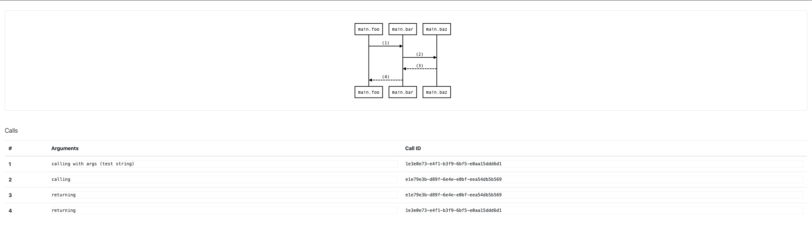

# prinTracer
[](https://travis-ci.org/DimitarPetrov/printracer)
[](https://coveralls.io/github/DimitarPetrov/printracer?branch=master)
[](https://goreportcard.com/report/github.com/DimitarPetrov/printracer)

## Overview

`printracer` is a simple command line tool that instruments all **go** code in the current working directory to print every
 function execution along with its arguments.
 
## Installation

#### Installing from Source
```
go get -u github.com/DimitarPetrov/printracer
```
Or you can download a binary for your system [here](https://github.com/DimitarPetrov/printracer/releases).

## Demonstration

### Code Instrumentation

Let's say you have a simple `main.go` file in the current working directory with the following contents:
```go
package main

import "fmt"

func test(i int, b bool) int {
	if b {
		return i
	}
	return 0
}

func main() {
	i := test(2, false)
	fmt.Println(i)
}
```

After executing:
```
printracer apply
```

The file will be modified like the following:
```go
package main

import "fmt"

func test(i int, b bool) int {
	fmt.Printf("Entering function test with args (%v) (%v)\n", i, b)
	defer fmt.Printf("Exiting function test\n")
	if b {
		return i
	}
	return 0
}

func main() {
	fmt.Printf("Entering function main\n")
	defer fmt.Printf("Exiting function main\n")
	i := test(2, false)
	fmt.Println(i)
}
```

You can also easily revert all the changes done by `printracer` by just executing:
```
printracer revert
```

### Visualization

Let's say you have instrumented your code and captured the flow that is so hard to follow even the textual trace is confusing as hell.
That's where visualization comes to rescue.

For example let's say you have captured the following trace and saved it to the file **trace.txt**:
```text
Entering function main
Entering function foo with args (1) (true)
Entering function bar with args (test string)
Entering function baz
Exiting function baz
Exiting function bar
Exiting function foo
Exiting function main
``` 

In practice this would be much more complicated but it is enough for the sake of demonstration.

Now when you execute:
```
printracer visualize trace.txt
```
A file with name `calls.html` will be generated

> NOTE: The name of the file can be provided via -o (--output) flag to the visualize command.


But in some situation this diagram can become so big that it becomes useless.

That's where `--depth (-d)` and `--func (-f)` flags comes to rescue.

- `--depth` flag controls how deep in the invocation graph you want your visualization to go.
- `--func` flag controls which function to be the starting point of the visualization.

So if you execute the following command with the trace of the previous example:
```
printracer visualize trace.txt --depth 2 --func foo
```
A diagram like this will be generated for you:



Much cleaner and focused on the let's say problematic part of the trace.

  
